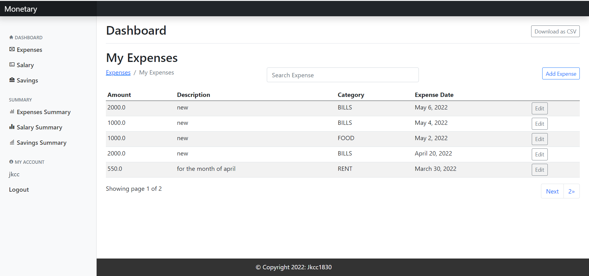
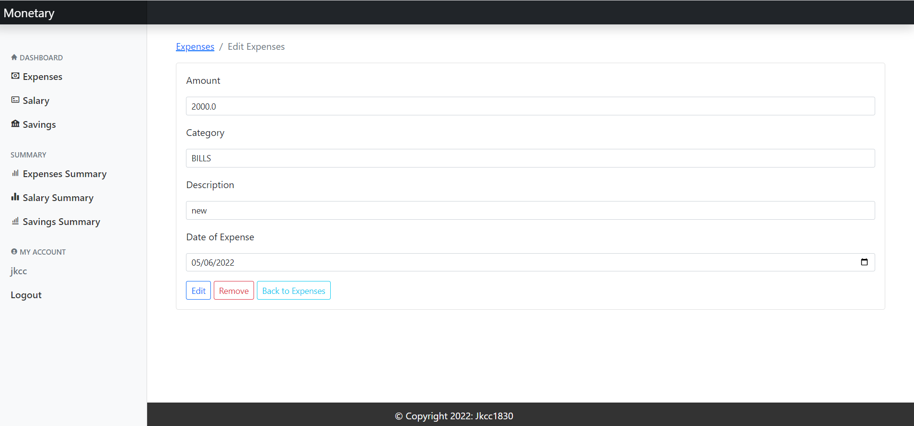
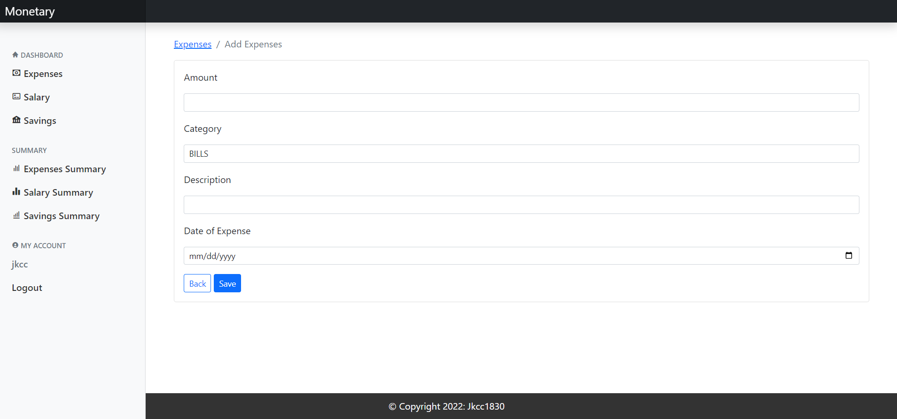
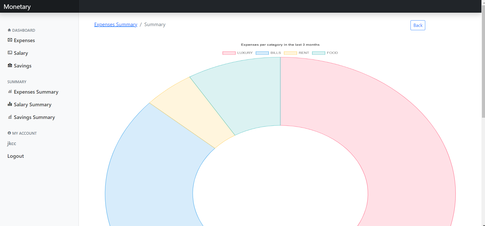
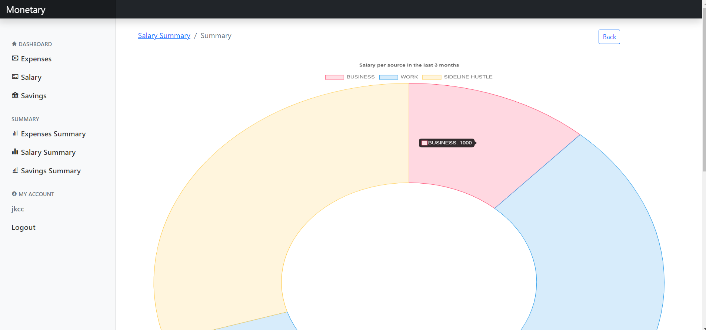
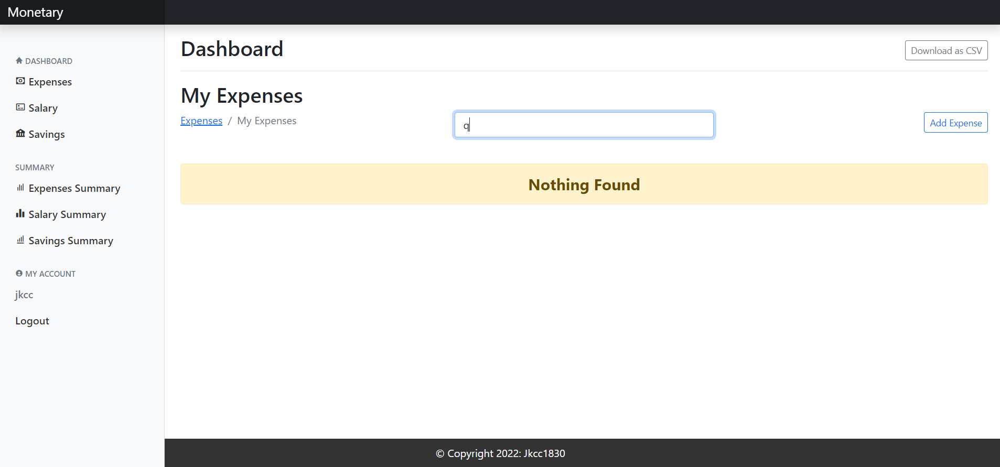

# Monetary-v1
---
Develpoer: JKCC

Monetary is an app users can use to monitor and keep track of their expenses, salary and savings. Users can add, edit and delete thei expenses, salary and savings accordingly. This app was develop to help users budget their allowances and money in general.

[Go to the website](https://monetary-v1.herokuapp.com/)

---

---
## Table of Contents
---
1. [Goals](#goals)
    * [Users Goals](#user-goals)
    * [Developer Goals](#owner-goals)
2. [User Experience](#user-experience)
    * [Target Crowd](#target-crowd)
    * [User Requirements and Expectation](#user-requirements-expectation)
    * [User Stories](#user-stories)
    * [Site Owner Story](#site-owner)
3. [Technologies Used](#technology)
    * [Languages](#languages)
    * [Frameworks and Tools](#frameworks)
4. [Features](#features)
    * [Sign up Page](#signup)
    * [Login Page](#login)
    * [Logout Page](#logout)
    * [Expenses Home Page](#expenses-home)
    * [Edit Expenses](#edit-expenses)
    * [Add Expenses](#add-expenses)
    * [Expenses Summary](#expenses-summary)
    * [Salary Home Page](#salary-home)
    * [Salary Summary](#salary-summary)
    * [Saving Home Page](#saving-home)
    * [Saving Summary](#saving-summary)
    * [Csv Page](#csv)
    * [Search](#search)
5. [Validation](#validation)
    * [PEP8 Validation](#pep)
    * [HTML Validation](#html)
    * [CSS Validation](#css)
    * [Javascript Validation](#js)
    * [User Stories Testing](#stories)
    * [Site Owner Story Testing](#owner)
6. [Bugs](#bugs)
7. [Deployment](#deployment)
8. [Credits](#credits)
9. [Acknowledgement](#acknowledgement)

---
## Goals
### User Goals
* To be able to create an account, log in and log out with email verifications to ensure safety of account.
* To be able to add, edit and delete expenses
* To be able to add, edit and delete salary
* To be able to add, edit and delete saving
* To be able to view summary of expenses, salary and savings
* To be able to download a csv file of expenses, salary and savings and print it out after.
* To be able to search of certain expenses, salary and saving
### Developer Goals
* To be able to help others keep track of their money and make the world a better place.
---

## User Experience

---
### Target Crowd
* People who wants to keep track of their money and for people who wants to help them budget.

### User Requirements and Expectations
* Average level of knowledge about computers and online shopping.
* Ability to input data.
* Easy to use
* Easily log in and out
* Easily create an account.
* Easily add, edit and delete expenses, salary and savings.

### User/Shopper Stories
Note: User stories are mapped out using the github projects section and made an issue template to easily mapped out the stories. This might not be coinciding on when I finished the portion of the user story, because I just added it as per assessors comment. And to let you know I know how to use it but I didnt have time to do it so I just wrote it down on paper and checked them as I finished that portion of the user story. But I supposed its an important part so rest assured that I will use this agile tool to map out my users stories in my future projects.
* To be able to create an account, log in and log out with email verifications to ensure safety of account.
* To be able to add, edit and delete expenses
* To be able to add, edit and delete salary
* To be able to add, edit and delete saving
* To be able to view summary of expenses, salary and savings
* To be able to download a csv file of expenses, salary and savings and print it out after.
* To be able to search of certain expenses, salary and saving
### Site Owner Story
1. As the site owner, I want to be able to have an admin account so I can add, edit and delete categories, sources to make the site better accordingly.
2. As the site owner, I want to be able to see all the users that has registered for an account and all the orders that has been done on the shop.

---
## Technologies Used
### Languages
* Python-Django
* HTML
* CSS
* Javascript
* Heroku-Postgres
* Cloudinary

### Framework and Tools
* Bootstrap5 - for the site design on desktop and mobile to be responsive.
* Github - used for storing the code for the site in a repositoty so other developers can see, fork and check it out.
* Basic kanban to map out user stories with issue templates
* Gitpod - the IDE used when developing the site
* Cloudinary - where all the static and media files are stored
* Heroku - where the app is deployed
* draw.io - for technical design and wireframes for the website
* https://favicon.io/favicon-converter/ - used to convert boxicons to favicon for the browser tab icon

### Techincal Design and Layout
Note: draw.io was used to draw up the technical design, wireframes and layout for the site. The idea was rooted by the fact that the developer is having problems monitoring or keeping track of his money that is why this site/app was made. The developer decided to share it with others sothat others can use it to login/out, register for an account to add, edit or delete expenses, salaries and savings to help them budget or keep track/monitor their money if they have the same problem with the developer. Thus, this site was made.

---
## Features
### Website Pages
The website is structured into pages, each with clear, concise structure, information and purpose. I use the Bootstrap grid system throughout, which gave a consistent structure and responsive design.
1. Signup Page: This is the signup page, where users can create an account. This uses a dashboard template with some changes from bootstrap5.

2. Login: This page allows the user to login to the site

3. Logout: This page allows the user to logout the site

4. Expenses Home Page: This page shows the expenses of the user.

5. Edit Expenses Page: This page where user can edit a certain expense.

6. Add Expenses page: This page is where users can add their expenses.

7. Expenses Summary Page: This page shows the expenses summary of the user.

8. Salary Home Page: This page shows the salaries of the user.

9. Salary Summary Page: This page shows the salary summary of the user.

10. Saving Home Page: This page shows the saving of the user.

11. Saving Summary Page: This page shows the saving summary of the user.

Note: Add, edit salary and saving have the same template as the expenses feature.
12. CSV Page: This page shows the saving summary of the user.

13. Search Page: This page shows the saving summary of the user.

---
## Validation
### PEP8 Validation
* http://pep8online.com/ was use to validate the python code written. Result came back with warnings of line of code too long. I am not sure how to fix them without ruining the site or it might not work if I edit it. Will try and learn how to do this in the future as for now, due to time constraints, I will leave it be as it is not affecting the overall performance of the site.
On one hand, with regards to Unitest, I am still not sure how to do this so I wasnt able to include any of these in the code. Will learn about this more in the future when I have more time to focus on it.
### HTML Validation
* https://validator.w3.org/ was used to check the html files on this site. According to the site, there 1 error on this site and no warnings. The error was about an h6 not being allowed to be a child of a ul. Will try and fix this in the future as for now, I will leave it be as it is not affecting the overall function of the site.
### CSS Validation
* https://jigsaw.w3.org/css-validator/ was used to check all the CSS files on this site. There were no errors or warnings found.
### JS Validation
* https://jshint.com was used to check the Javascript files used in this site. There were warnings about template literal only available in ES6
## User Stories Testing
1. To be able to create an account, log in and log out with email verifications to ensure safety of account.

| Feature      | Action    | Result    |
| :------------- | :----------: | -----------: |
| Signin,Signout and register page | When you opened the app, it will ask the user to either log in or create an account if one doesnt have it.   | Worked    |

Note: For some reason I think I made a mistake in deploying the site because only the superuser I created can only be the one to see the content of the site. There is a problem when a new user creates an account, after successfully creating an account, the new user will not be able to see the template of the site for expenses, salary and saving. I have an idea on where I went wrong but for lack of time, I wasnt able to fix it but will do so after this.

2. To be able to add, edit and delete expenses

| Feature      | Action    | Result    |
| :------------- | :----------: | -----------: |
| Add, edit and delete page | When you opened the app, and click on the add expenses button, users will be able to add a new expense, and when clicking edit, users can edit or delete the chosen expense. | Worked    |

Note: For some reason I think I made a mistake in deploying the site because only the superuser I created can only be the one to see the content of the site. There is a problem when a new user creates an account, after successfully creating an account, the new user will not be able to see the template of the site for expenses, salary and saving. I have an idea on where I went wrong but for lack of time, I wasnt able to fix it but will do so after this. This feature is the same for the salary and saving page.

3. To be able to view summary of expenses, salary and savings

| Feature      | Action    | Result    |
| :------------- | :----------: | -----------: |
| Expenses, Salary, Saving Summary page | When you click on the sidebar option of expenses, salary, saving summary it will bring to the summary page where there is illustration showing all the expenses, salary and saving breakdown.  | Worked    |

4. *  To be able to download a csv file of expenses, salary and savings and print it out after.

| Feature      | Action    | Result    |
| :------------- | :----------: | -----------: |
| CSV page | When user clicked on the download as csv button, it will allow users to download the file and print it after either for expenses, salary or saving. | Worked    |

5. To be able to search of certain expenses, salary and saving

| Feature      | Action    | Result    |
| :------------- | :----------: | -----------: |
| Search page | When you enter key words or letters on the search bar, it will show all the expenses, salary or saving that has those letter or words on them. | Worked    |

### Site Owner Story Testing
1. As the site owner, I want to be able to have an admin account so I can add, edit and delete categories, sources to make the site better accordingly.

| Feature      | Action    | Result    |
| :------------- | :----------: | -----------: |
| Admin Page | When the site owner has a admin account access, he or she will be able to add, edit, delete products on the product management option or when logged in as a owner and validated superuser, all the items will have an edit or delete options on them.   | Worked    |

2. As the site owner, I want to be able to see all the users that has registered for an account and all the orders that has been done on the shop.

| Feature      | Action    | Result    |
| :------------- | :----------: | -----------: |
| Admin Page | This is possible when you add /admin to the website url, and enter your admin login. Tested using the superuser I made.   | Worked    |

---
## Bugs
* Im not sure if its a bug or if I deployed it the wrong way or used the wrong static file storage, but for some reason everytime I create a new user, the registration will be successful but when logged in, the user cant see the expenses, salary or saving table. Due to lack of time and stress, I was only able to present and submit with the superuser account. 
* Was able to fix this issue above when I checked the code. Now its working properly.

---
## Depolyment
### The website was deployed using Heroku by following these steps:

1. Use the "pip3 freeze > requirements.txt" command in the terminal to save any libraries that need to be installed in the file.
2. Login or create a Heroku account
3. Click the "new" button in the upper right corner and select "create new app".
4. Choose an app name and your region and click "Create app".
5. Go to the "settings" tab, add the python build pack and then the node.js build pack and add all the variables needed for the site.
6. Go to the "deploy" tab and pick GitHub as a deployment method.
7. Search for a repository to connect to
8. Click enable automatic deploys and then deploy branch
9. Wait for the app to build and then click on the "View" link.

Note: There was a problem will heroku so I needed to deploy the site, on the gitpod terminal. 
1. I logged in to my heroku account on the gitpod terminal using heroku login -i
2. After logging into my account, I remotely connect to heroku with the following command to the terminal, heroku git:remote -a monetary-v1(the name of the app in heroku)
3. Lastly, push the repository to heroku main and typing the following command on the gitpod terminal, git push heroku main

### You can fork the repository by following these steps:

1. Go to the GitHub repository.
2. Click on the Fork button in the upper right-hand corner.

### You can clone the repository by following these steps:

1. Go to the GitHub repository
2. Locate the Code button above the list of files and click it
3. Select if you prefer to clone using HTTPS, SSH, or Github CLI and click the copy button to copy the URL to your clipboard.
4. Open Git Bash
5. Change the current working directory to the one where you want the cloned directory.
6. Type git clone and paste the URL from the clipboard ($ git clone https://github.com/YOUR-USERNAME/YOUR-REPOSITORY)
7. Press Enter to create your local clone.

---
## Credits
* Making this app was inspired by me not able to budget and keep track of my money properly.
### Code
* The codes were based and modified from youtube tutorials and stackoverflow as well as the dashboard template from bootstrap.
* Django documentations
* Chart JS documentations
* Bootsrap5 Examples
### Overall UI
* This was inspired by the dashboard template in bootstrap with some modifications.

---
## Acknoledgements
### I would like to take this opportunity to thank:
* Code institute for the tutorial on how python-django works.
* Google
* Youtube
* boxicons.com - for the icons on the site
* Lastly, I would like to thank JK, you know who you are. Thanks for the advice, for cheering me up when I'm stressed out and thank you for your belief in me that I can do this course and succeed.

## Notice and Plans for the Future
This was based on the last project I submitted on my PP4 thus there are less commits on this project as it is a resubmission. I just added some extra touch to make user experience better and some more documentation to support it.
There are things that I want to add onto this site that might improve the overall experience of users. First, is to add a profile management where users can edit their profiles. Second, is to add like a currency option so user from all over the world can choose whats is appropriate for them. I did my best to do this site eventhough there are more things to improve.
